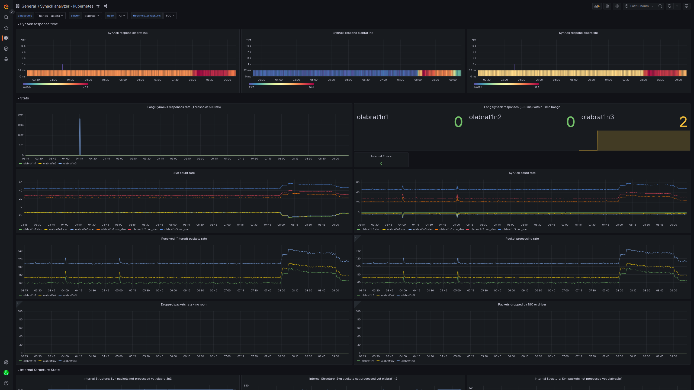

# Synack analyzer

Synack analyzer is a simple utility which measures delta time between SYN and
SYNACK packet when creating a TCP connection. If that time is more than
`THRESHOLD_SYNACK_MS` then SYNACK packet is logged and both SYN and SYNACK
packets can be dumped into a _pcap_ Wireshark compatible file, check utility
flags.

Metrics from this utility can be visualized e.g. in grafana:


## How to build and run

You can build it and run in docker. Rootless docker mode was not tested. To
build it natively, package `libpcap0.8-dev` is required on Debian based linux
distribution.  Check [Makefile](./Makefile) for more information.

```
make build-docker
make run-docker-help
make run-docker
```

Prometheus metrics can be found at `/metrics` endpoint. To enable them start it with `--metrics-port $PORT`.

Logger configuration can be tunned via environment variable
[RUST_LOG](https://docs.rs/env_logger/0.10.0/env_logger/index.html#enabling-logging),
e.g. `RUST_LOG=synack_analyzer=debug`. By default `INFO` level is used.

### Flags

```
Synack analyzer. Can be used on client side and also on server side. Libpcap is internally used, it has to be installed as this is not a statically-linked program. You have to be a root or have at least CAP_NET_RAW capability.

Usage: synack-analyzer [OPTIONS] --threshold-synack-ms <THRESHOLD_SYNACK_MS>

Options:
  -t, --threshold-synack-ms <THRESHOLD_SYNACK_MS>
          Threshold for SYNACK in ms

          When an synack is received after the specified threshold, syn and synack will be dump into file

          [env: THRESHOLD_SYNACK_MS=]

  -i, --interface <INTERFACE>
          Network interface

          Network interface to sniff packets

          [env: INTERFACE=]
          [default: any]

      --capture-reset-packets
          Capture tcp RST packets

          Capture tcp RST packets

          [env: CAPTURE_RESET_PACKETS=]

  -d, --destination-port <DESTINATION_PORT>
          Destination port

          Destination port used in filtering

          [env: DESTINATION_PORT=]

      --disable-dumping
          Disable dumping

          Disable dumping late synack and syn packets into a file.

          [env: DISABLE_DUMPING=]

      --dump-retrans-packets
          Dump retrans packets

          Dump into file also Syn and SynAck retrans packets

          [env: DUMP_RETRANS_PACKETS=]

  -b, --bpf-filter <BPF_FILTER>
          BPF filter

          Berkeley Packet Filter: https://biot.com/capstats/bpf.html

          [env: BPF_FILTER=]

  -o, --output-dir <OUTPUT_DIR>
          Output directory

          [env: OUTDIR=]
          [default: .]

      --immediate-mode
          Immediate mode - libpcap

          In immediate mode, packets are always delivered as soon as they arrive, with no buffering

          [env: IMMEDIATE_MODE=]

      --promiscuous-mode
          Promiscuous mode - libpcap

          Promiscuous mode or promisc mode is a feature that makes the ethernet card pass all traffic it received to the kernel

          [env: PROMISCUOUS_MODE=]

      --buffer-libpcap-size <BUFFER_LIBPCAP_SIZE>
          Buffer Size - libpcap (use >2048)

          Buffer size for incoming packet data

          [env: BUFFER_LIBPCAP_SIZE=]
          [default: 4200000]

      --metrics-port <METRICS_PORT>
          Prometheus metrics port

          [env: METRICS_PORT=]

  -h, --help
          Print help (see a summary with '-h')

  -V, --version
          Print version
```

## TODOs

- garbage collection for SYN packets for which no SYNACK arrived
- multithreading
- output files rolling
